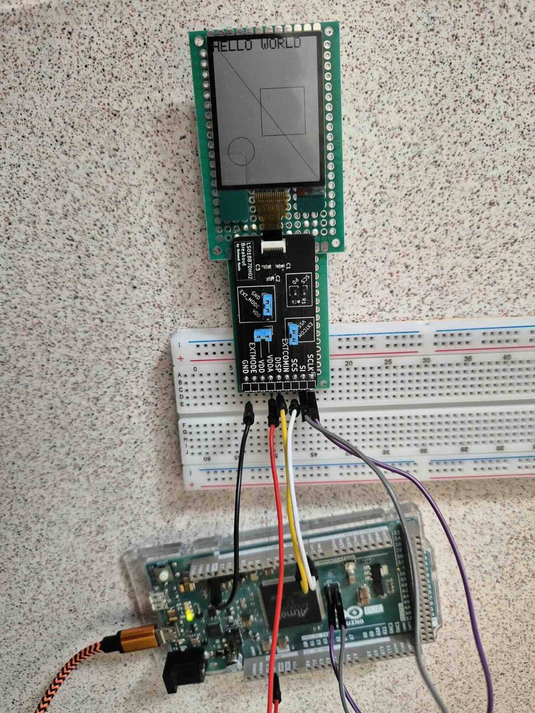
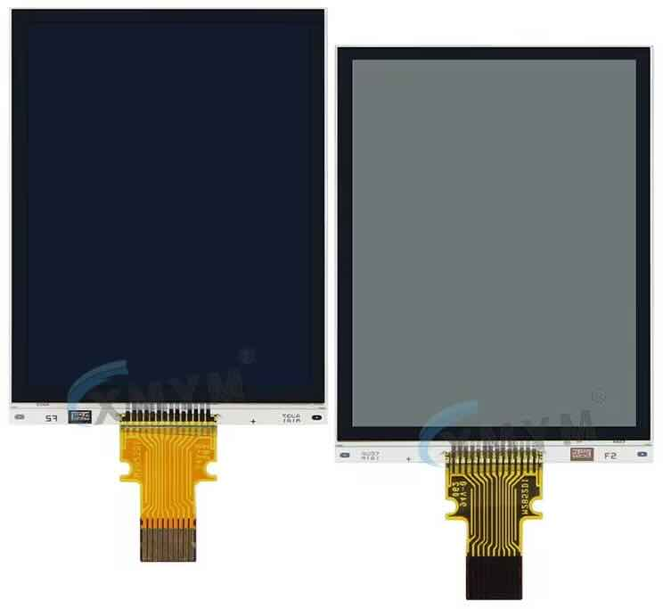
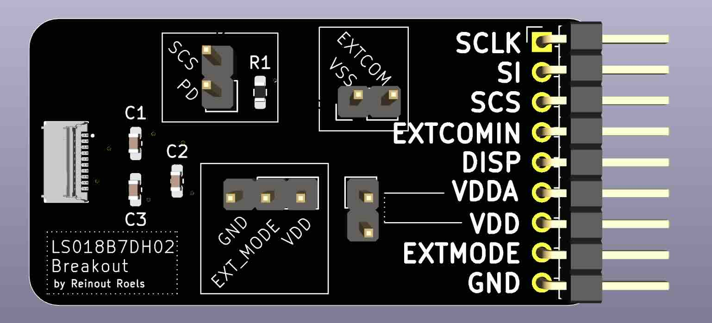
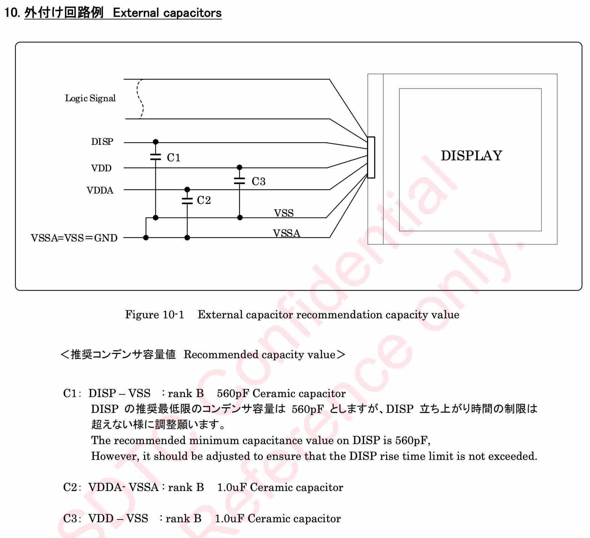
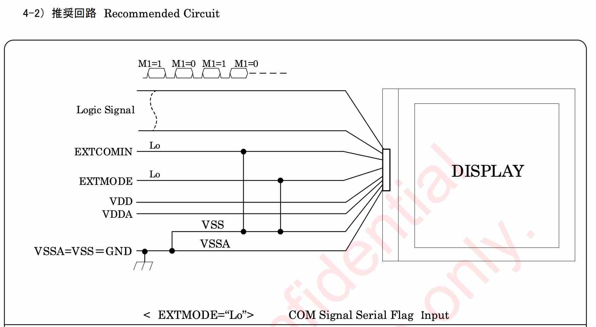
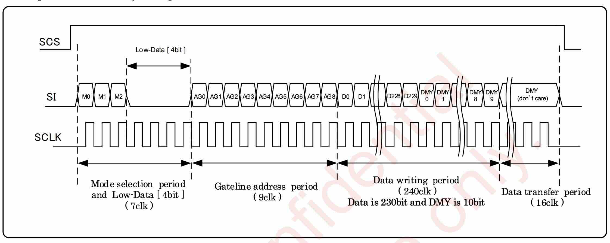

# Arduino Driver for Sharp LS018B7DH02 Memory LCD

## Introduction

At the time of writing, there is no Arduino driver for the Sharp LS018B7DH02 Memory LCD. They do exist for other Sharp models, such as the one sold by [Adafruit](https://www.adafruit.com/product/3502), but sadly they are not compatible with this model.

This repository contains a modified version of the Adafruit Memory LCD driver, specifically for the Sharp LS018B7DH02 Memory LCD.

It is built on top of the Adafruit GFX library, so it supports the usual Adafruit GFX functionality, such as rendering of lines, circles, squares, text, etc.

It should be compatible with any Arduino board with enough RAM (> 10KB) and SPI capabilities. Development and testing of this library was done with an Arduino Due and a XIAO nrf52840.



## Sharp LS018B7DH02 Details



(image taken from nameless AliExpress Store)

Specs:
* width: 31mm
* height: 41.46mm
* diagonal: 1.8inch
* resolution: 230x303px

See website and [datasheet](datasheets/LS018B7DH02_31Oct23_Spec_LD-2023X08.pdf) for more information:

https://www.sharpsde.com/products/displays/model/ls018b7dh02/

### How to Use

See the `example` folder for the driver code, and `example/example.ino` for an example ino file.

As the modified driver maintains the original interface of the Adafruit Memory LCD driver and Adafruit GFX library, the way to use it is the same:

```c++
#include <Arduino.h>
#include "Adafruit_SharpMem.h"

#define PIN_CS 2
#define PIN_MOSI 75
#define PIN_CLK 76

#define BLACK 0
#define WHITE 1

Adafruit_SharpMem display(PIN_CLK, PIN_MOSI, PIN_CS, 230, 303, 2000000);

void setup()
{
    // enable DISP pin
    pinMode(3, OUTPUT);
    digitalWrite(3, HIGH);

    display.begin();
    display.clearDisplay();
}

void loop()
{
    display.clearDisplayBuffer();

    display.drawRect(100, 100, 100, 100, BLACK);
    display.drawLine(0,0,229,302, BLACK);
    display.drawCircle(50, 230, 30, BLACK);

    display.setTextSize(3);
    display.setTextColor(BLACK);
    display.setCursor(0, 0);
    display.println("HELLO WORLD");

    display.refresh();
    delay(1000);
}
```

Note that just like the original Adafruit Memory LCD driver, there is a dependency on the Adafruit GFX Library.
You might still have to install this library via the Arduino IDE or `arduino-cli`.

## Hardware Setup

The hardware setup is pretty standard compared to other Memory LCD displays. 

For convenience, I made a small breakout board:



See the dedicated repository for more info: [https://github.com/rroels/LS018B7DH02-breakout](https://github.com/rroels/LS018B7DH02-breakout
)

This breakout board is however not a requirement for the driver or for this display in general. 

For basic operation you just need 3 capacitors (see reference circuit in datasheet):



Just like the original Adafruit Memory LCD driver, this driver supports the software-based EXTCOM signal ("COM Signal Serial Flag Input"). 
For that, you should connect EXT_MODE to GND, and EXTCOMIN to GND.
This is also described in the [datasheet](datasheets/LS018B7DH02_31Oct23_Spec_LD-2023X08.pdf).



The hardest part is breaking out the tiny pins on the display's FPC connector, into something more manageable. For that one could consider a generic FPC breakout adapter. 
Those can be purchased on for instance AliExpress (search for "FPC adapter 0.5 pitch 10 pins").

## Driver Info

### Communication Protocol

The main reason why existing memory LCD drivers don't work with the LS018B7DH02, is that it uses 9 bits for line numbers in the SPI communication format. 
The reason for this is that the LS018B7DH02 has 303 rows, so you need 9 bits to refer to a specific line row. The other smaller, more common, memory displays have a smaller resolution (e.g. the one sold by Adafruit), and their communication protocol uses 8 bits to refer to a line number. 

This is further complicated by the fact that the display needs this 9 bit number split into 2 bytes, in LSB order. 

From the LS018B7DH02 datasheet:



As you can see, the data to update a single row is:
* 2 bytes containing "command bits" and the row number to update 
  * note that the row number spans across both bytes, sent in LSB order
* 30 bytes of image data, one bit per pixel
  * note that a row's image data is only 230 bits, but it requires another 10 bits of "padding"
* 2 empty bytes 

To update more than one row, wait to send the final empty bytes until the last row:
* 2 bytes containing "command bits" and the row number to update
* 30 bytes of image data, one bit per pixel
* ...
* 2 bytes containing "command bits" and the row number to update
* 30 bytes of image data, one bit per pixel
* 2 empty bytes

### Implementation

I chose to modify the existing Adafruit Memory LCD driver, instead of starting from scratch.
This also makes it compatible with the Adafruit GFX library, with relatively little effort.

Concrete changes:
* made `sharpmem_buffer` larger
* adjusted `drawPixel()`, `getPixel()`, `clearDisplay()`, `clearDisplayBuffer()` for new buffer size
* rewrote `refresh()` for transferring data to the display in the required LS018B7DH02 format

See the `example/` folder in this repository for the modified code.

## Speeding up the display refresh

To maintain a broad compatibility, I kept the use of the slower `Adafruit_SPIDevice` for SPI transfers. 
However, depending on your board, you might achieve much faster refreshes by using board-specific hardware SPI.

To achieve this, simply replace the relevant SPI calls in the code, especially in the `refresh()` function.

Currently the refresh function looks something like this:

```c++
void Adafruit_SharpMem::refresh(void) {
    ...
    spidev->beginTransaction();
    ...
    spidev->transfer(...);
    ...
    spidev->endTransaction();
    ...
}
```

Simply replace these SPI calls with whatever native flavour of SPI you want to use. For example, for the Seeed XIAO nrf52840 it looks like this:

```c++
#include <SPI.h>

SPI.begin(); // call this during for instance setup()
  
void Adafruit_SharpMem::refresh(void) {
    ...
    SPI.beginTransaction(SPISettings(4000000, LSBFIRST, SPI_MODE0));
    ...
    SPI.transfer(...);
    ...
    SPI.endTransaction();
    ...
}
```

As the support for hardware SPI, and the way to use it, differs from board to board, you have to make this change yourself if a higher refresh speed is required.

## Sources

* [https://www.sharpsde.com/products/displays/model/ls018b7dh02/](https://www.sharpsde.com/products/displays/model/ls018b7dh02/)
* [LS018B7DH02 Datasheet](datasheets/LS018B7DH02_31Oct23_Spec_LD-2023X08.pdf)
* [Sharp Application Notes: Programming Sharp’s Memory LCDs](datasheets/2016_SDE_App_Note_for_Memory_LCD_programming_V1.3.pdf)
* [https://github.com/jeffc/nrf52-watch-firmware/tree/master/lib/memory_lcd_spi](https://github.com/jeffc/nrf52-watch-firmware/tree/master/lib/memory_lcd_spi)
* [https://github.com/adafruit/Adafruit_SHARP_Memory_Display](https://github.com/adafruit/Adafruit_SHARP_Memory_Display)
* [https://www.azumotech.com/products/1-8-monochrome-display-12616-03/](https://www.azumotech.com/products/1-8-monochrome-display-12616-03/)